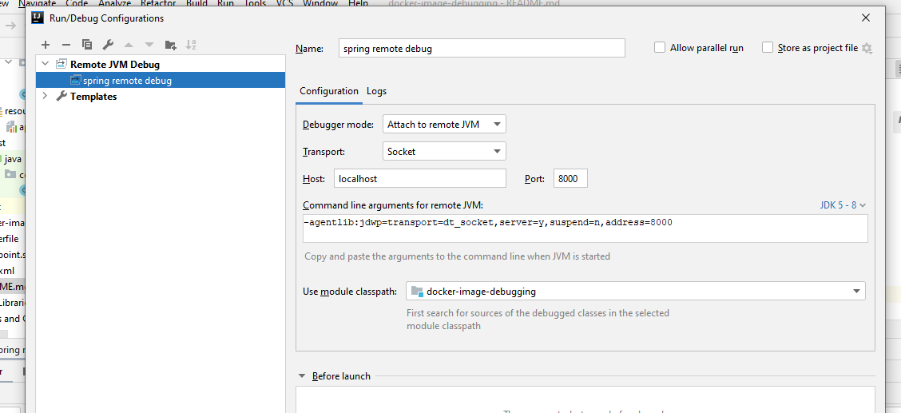

# Spring Boot Docker Remote Debug

Remote debugging for docker application

Endpoint: http://localhost:8080/employees/Developer

#### Steps to build and run application

1. Build Docker File:

   		docker build -t spring-docker-debug:1.0 .
   
2. See docker images by below command:

   		docker images
   		
3. Run docker container, here 8000 will be used to debug the application from intellij
   	
docker run -p 8080:8080 -p 8000:8000 spring-docker-debug:1.0
   
4. Create Remote JVM Debug as a configuration and put 8000 as a port and run as a debug and set debug point and hit the end point from the browser

